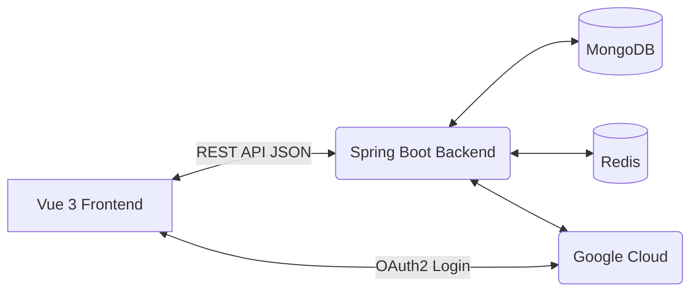

# ♻️ Smart Waste Management System

A modern, full-stack application designed to streamline city waste management. It allows citizens to report waste issues, admins to manage and assign complaints, and sanitation workers to receive tasks and track their GPS location in real-time.

This project features a decoupled architecture with a **Vue 3** frontend and a **Spring Boot** backend, utilizing **MongoDB** for persistence, **Redis** for caching and sessions, and **Google OAuth2** for seamless authentication.

---

## 🛠️ Tech Stack

### Frontend (Client-Side)
- **Framework:** Vue 3 (Composition API)
- **Build Tool:** Vite
- **Styling:** Tailwind CSS v4
- **Routing:** Vue Router
- **Maps Integration:** Leaflet.js (OpenStreetMap)

### Backend (Server-Side)
- **Framework:** Spring Boot 3.5
- **Language:** Java 17+
- **Security:** Spring Security 6, OAuth2 Client
- **Database:** MongoDB (Spring Data MongoDB)
- **Cache & Session:** Redis (Spring Data Redis, Spring Session)

---

## ✨ Key Features

- **🔐 Secure Authentication:** Supports traditional form-based login and Google OAuth2 Single Sign-On (SSO).
- **👥 Role-Based Access Control (RBAC):**
  - **Citizen (USER):** Can submit waste complaints by dropping a pin on an interactive map.
  - **Admin (ADMIN):** Views all complaints, assigns tasks to workers, and monitors worker locations in real-time.
  - **Worker (WORKER):** Receives assigned tasks, marks them as cleaned, and continuously broadcasts GPS location while active.
- **🗺️ Interactive Mapping:** Citizens can visually select issue locations on a map, and admins can view worker GPS history rendered as interactive polylines.
- **📡 Real-Time GPS Tracking:** Workers' browser geolocation is captured and sent to the backend every 30 seconds for admin tracking.
- **⚡ High Performance:** Utilizes Redis for caching frequently accessed data (like worker locations and complaint lists) and managing distributed HTTP sessions.

---

## 🏗️ Architecture Overview

The system is built on a modern decoupled architecture:



- **Frontend:** Runs independently (e.g., via Vite dev server on port `5173`). It acts as a Single Page Application (SPA).
- **Backend:** Exposes RESTful endpoints under `/api/**`. Runs on port `8080`.
- **Proxy:** During development, Vite proxies all API and OAuth requests from the frontend to the backend to maintain a single origin for session cookies.

---

## 🚀 Quick Start Guide

### Prerequisites
- **Node.js** (v18+) and npm
- **Java 17+** and Maven
- **MongoDB** running locally on port `27017`
- *(Optional for Dev)* **Redis** running locally on port `6379`. (The app is configured to fall back to in-memory caching/sessions if Redis is not running during local development).

### 1. Backend Setup (Spring Boot)
1. Open a terminal in the project root directory.
2. (Optional) Configure environment variables in `src/main/resources/application.properties`:
   - `GOOGLE_CLIENT_ID`
   - `GOOGLE_CLIENT_SECRET`
3. Run the Spring Boot application:
   ```bash
   # On Windows
   .\mvnw.cmd spring-boot:run

   # On Mac/Linux
   ./mvnw spring-boot:run
   ```
   *The backend will start on `http://localhost:8080`.*

### 2. Frontend Setup (Vue)
1. Open a **second terminal** and navigate to the `frontend` directory:
   ```bash
   cd frontend
   ```
2. Install Node dependencies:
   ```bash
   npm install
   ```
3. Start the Vite development server:
   ```bash
   npm run dev
   ```
   *The frontend will start on `http://localhost:5173`.*

### 3. Usage
- Open **`http://localhost:5173`** in your browser.
- **Demo Accounts (Pre-configured):**
  - **Admin:** `admin` / `admin123`
  - **Worker:** `worker1` / `worker123`
  - **Citizen:** `user1` / `user123`

---

## 🌐 Google OAuth2 Setup

To enable "Continue with Google" functionality:
1. Go to the [Google Cloud Console](https://console.cloud.google.com/).
2. Create a new project and navigate to **APIs & Services > Credentials**.
3. Create an **OAuth 2.0 Client ID** (Web application type).
4. Set the **Authorized redirect URIs** to your Spring Boot backend URL:
   - For local development: `http://localhost:8080/login/oauth2/code/google`
5. Copy the Client ID and Client Secret and inject them as environment variables (`GOOGLE_CLIENT_ID` and `GOOGLE_CLIENT_SECRET`).

---

## 📦 Deployment

This application can be deployed in two primary ways:

1. **Cloud Native (Recommended):** Host the Vue frontend on a CDN like Vercel or Netlify, and host the Spring Boot backend on a PaaS like Railway or Render. Use MongoDB Atlas and Upstash for managed databases.
2. **VPS / Docker:** Build the Vue frontend and package it inside the Spring Boot `.jar` (by placing the Vue `dist` folder into Spring Boot's `src/main/resources/static`). Deploy the entire monolith using Docker Compose alongside MongoDB and Redis containers.

*Note: For production, ensure `spring.session.store-type=redis` and `spring.cache.type=redis` are uncommented in your `application.properties` to enable distributed sessions.*
